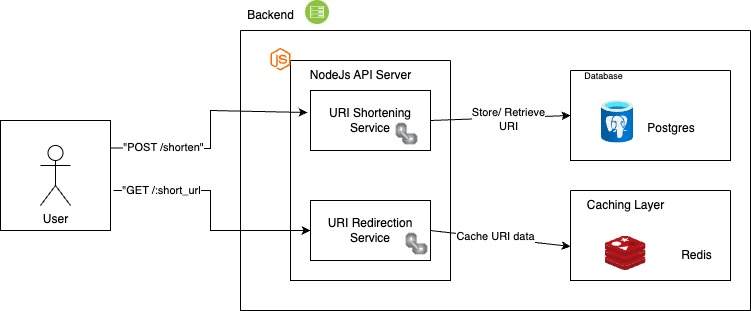

# URL Shortener
A Long URL to Shorten URL

# project setup
- npm install
- setup postgres database
  
  ```
    const pool = new Pool({
    user: USER_NAME,
    host: HOST_NAME,
    database: DATABASE_NAME,
    port: PORT,
  }};
- run command : node app.js

# packages
- shortid for shorten url
- redis
- swagger
- jest

# swagger
http://localhost:[PORT]/api-docs

# software design documentation

Documentation URL : https://worldai.bitdocs.ai/share/d/bkIRiPYoc0gg6ojc



